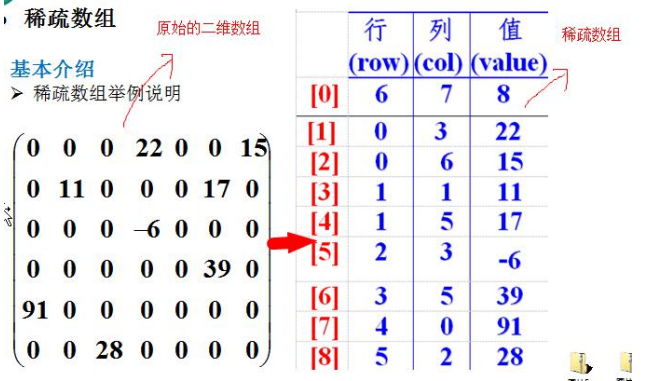

### 引入：   
    问题一：字符串匹配问题   
        1.暴力破解 [简单，效率低]  
        2.KMP算法 《部分匹配表》  
    问题二：汉诺塔问题  
        1.分治算法  
    问题三：八皇后问题  
        1.回溯算法  
    问题四：马踏棋盘算法  
        1.图的深度优先遍历算法（DFS） + 贪心算法优化  
#### 数据结构和算法介绍
    数据结构包括：线性结构 和 非线性结构  
    线性结构常见的有：数组、队列、链表和栈  
        特点：数据元素之间存在一对一的线性关系  
        线性结构两种存储结构：顺序存储结构和链式存储结构  
    非线性结构包括：二维数组，多维数组，广义表，树结构，图结构  
### 正文  
##### 稀疏数组：  
    当一个数组大部分元素为0，或者为同一个值的数组时，可以使用稀疏数组来保存该数组。  
    处理方法：  
        记录数组有几行几列，有多少个不同的值  
        把具有不同值的元素的行列及值记录在一个小规模的数组中，从而缩小程序的规模。

        